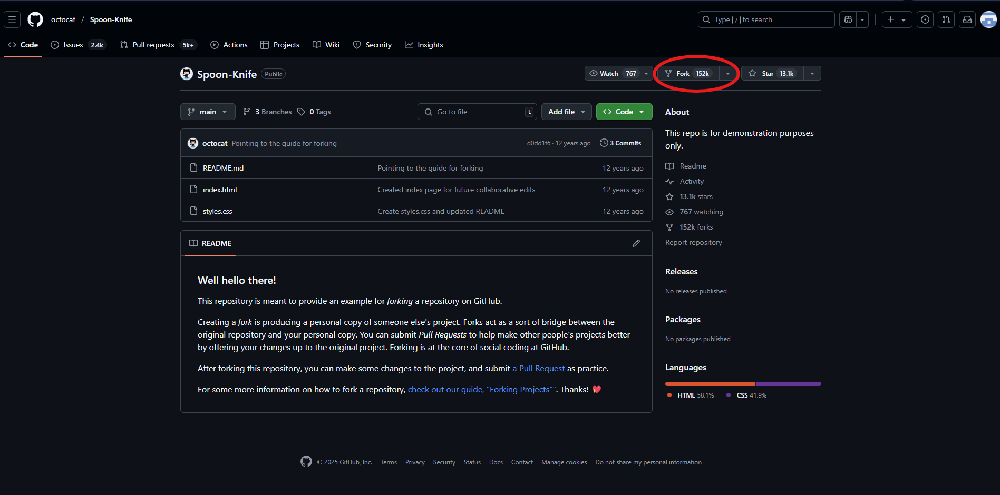
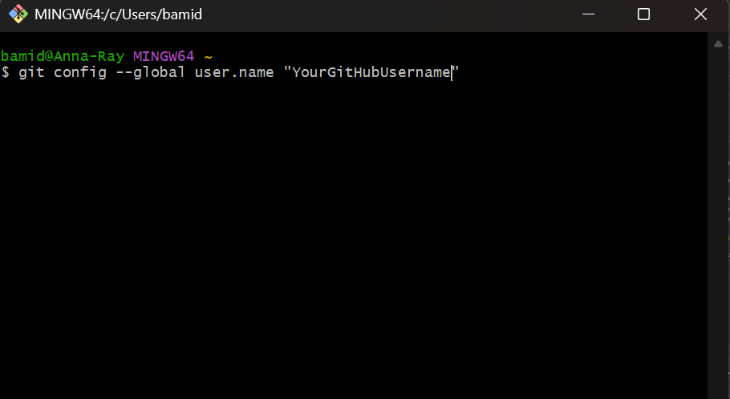
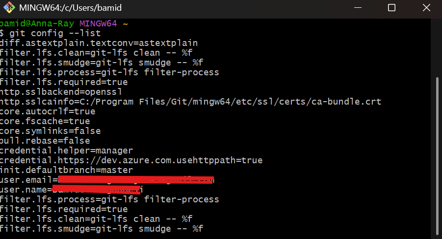
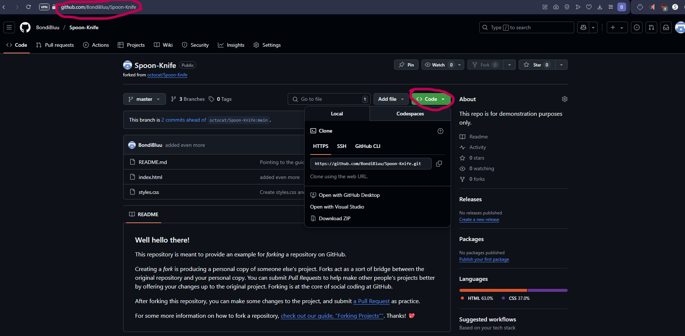
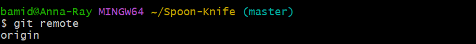
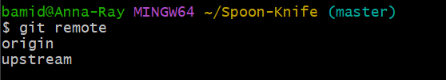

- What is forking? 
	- Making a new codebase or project by duplicating an existing one.
	- Essentially, making a personal copy of a project that already exists. 
	- This lets you freely experiment with changes without affecting the original project.

# Prerequisites
- Must have a [GitHub account](https://github.com)
- Must have [Git Bash](https://git-scm.com/downloads)  installed

# How to Fork a Repository

We're going to fork an existing GitHub project in order to freely make changes on the project without editing the original.

- Go to the GitHub.
- Find the repository you want to fork from. For example, go to a GitHub with the username `octocat`, then click on their **Spoon-Knife** project.
	- https://github.com/octocat/Spoon-Knife
- Create a fork (located on the top right of the page) of that repository. 

  		
- If there are `no available destinations to fork this repository`, you'll see your GitHub username/Spoon-Knife. 
	- This is telling you what your own version of this project is going to be named. Click on that.
	- Your own copy has now been created.
- Leave that for now and go to your git bash. 
## Configuring Git

You'll need to set up git bash in order to continue this tutorial. Download it using the link above if you haven't already.

- These are the steps to make a git bash account
	- `git config --global user.name "your-GitHub-username"` (make it the account name you’re using.)
		- Though, some teams you'll be on would like you to use your actual name. Use that if this is the case. 
		
  			
- Configure your email as well. This uses the same method as `config user.name` 
	- `git config --global user.email "email@email.com"`
    
- Check if you've done the steps correctly:
	- `git config --list`
	- The list should show both that you typed in as your username and email.

   		
   
## Clone Your Fork Locally

Cloning puts our repository on our local machine. You can then work online, use local editors  (VS Code, etc) or debuggers for your project. When you're done with this fork, you can push them back into your forked repository on GitHub or open a pull request to the original project.

- While you're still in git bash:
	- Clone the URL of the repository you're trying to clone
		- If you haven't left your **Spoon-Knife** version of your repository, the page URL is the URL that you need. Just copy it and use `git clone`.
		- You can also, while you're on your version of the repository, click on `< > Code`
			- The tab will be on `HTTPS`. Copy the URL and clone:
		
  		
   
		- `git clone the-URL-of-your-repo`
	- Switch into the directory you just made. 
		- `cd Spoon-Knife`
			- Note: `cd` means "change directory" in Git. Use it to go into and out of any directory in that folder.
	- You're currently on the master branch.
		- If you're wondering, the `origin` is already set up when you’ve cloned it. Try `git remote` to see.
    
		

## Get a Reference to Upstream ( the Original Repository)

This is for if you ever want to insert your changes into the original repository (`octocat's` repository).

- Add the original repository
	 - `git remote add upstream the-URL-of-the-repository-you-forked-from`
		 - (in this case, `https://github.com/octocat/Spoon-Knife`)"
- Do a `git remote`. You have the repository there.

  	
  
	- This shows both the `origin` (your copy) and `upstream` (the original repository).

## Keep Your Fork in Sync 

- If you ever want to fetch changes from the original repository after you've made changes to yours:
	- `git fetch upstream`
		- You’ve now got the `upstream` repo.
	- This is used to get updated code if the OG repo is newer than your own.
- If you've made made changes, everything that's been modified is red.
	- You can check this using `git status`. 
- Add the modifications to the commit stage:
	- `git add file-name`
		- or
	- `git add` . (this adds every change)
- `git status` again to see if everything is added.

## Commit Changes

This section explains how to grab a save point in your project (a commit) and push it to GitHub.

- It's good practice to send a message describing the changes you've made to your branch. You're already working with a team, so they need to know what changes you've made. 
	- `git commit -m "your message describing what you’ve done"`
- Now to push the changes:    
	- `git push origin master`. 
		- You’ve now pushed your master branch up to origin. The changes you've made have now been stored in the remote repository (the origin) and your team can see your update.

## Bonus: Create/Edit Files Using Git Bash

- To make any changes you want to files from the git bash terminal, you can use `cat`.
	- Note: this is completely optional and not a common method to edit files.
		- It's better to edit files in a code editor like VS Code, then save in said editor.
	- Edit a file in the terminal:
		- `cat > file-name.txt`
			- Then type what you want directly into the terminal.
		- `Crtl+D` when you're done to save and exit.
			- If the file already exists, these changes will overwrite the file.

## Summary

|Step|Command|
|---|---|
|Configure Git|`git config --global user.name/email`|
|Clone Repo|`git clone <URL>`|
|Change Directory|`cd <folder>`|
|Stage Changes|`git add .` or `git add <file>`|
|Commit|`git commit -m "your message"`|
|Push|`git push origin master`|
